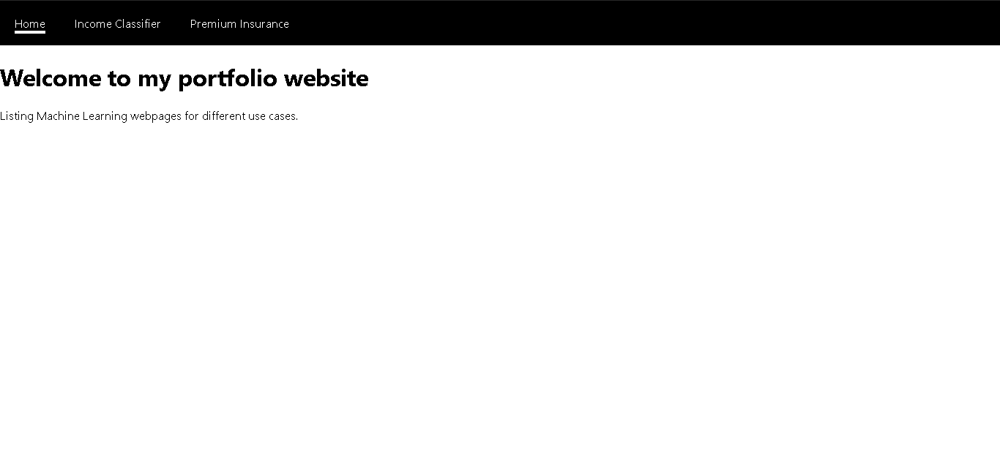
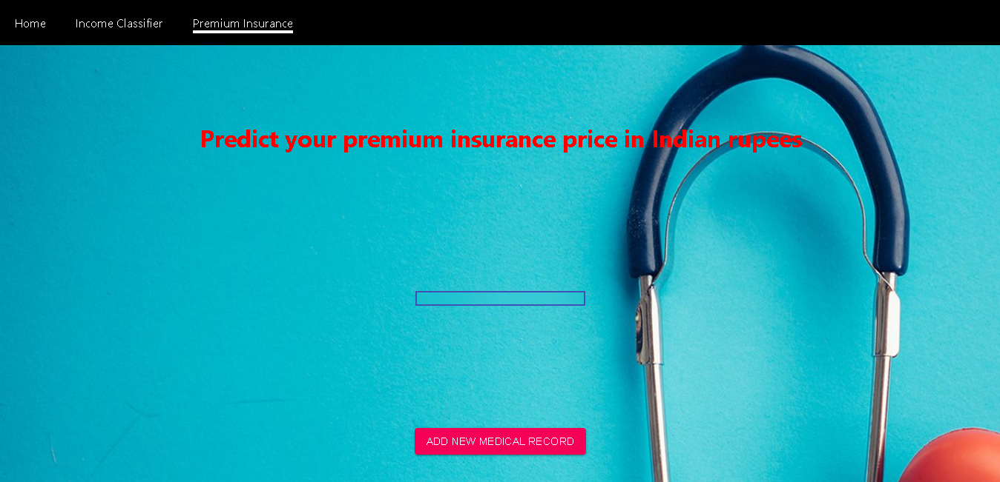

# ML Income Prediction Webapp

This project was created as a frontend to interact with `income-classifier` endpoint of [the Django backend](https://github.com/DoTrongAnh/ML-service-demo) through REST API.

## Visual presentation

For the sake of simplicity, the app only has one page, which consists of a title, a list of input personal information, and a button to add some more.

Clicking on the button presents a dialog form with dropdown menus and text fields to input numbers. These inputs represent a person's information regarding their age, race, sex, occupation, etc..

Once all inputs have been filled and `Predict income` is pressed, a POST request is then sent to `http://127.0.0.1:8000/api/v1/income_classifier/predict` with data body containing the personal info from the form. A response with the prediction result is received, followed by the notice.

The personal info and prediction result are stored as an item in the list on the main page. Clicking on the item reveals a dialog box with unmodifiable personal info and the prediction result.

## Update (8/27/2021)
Added React Router module so simulate a multi-page browsing experience. Also added a page to interact with `premium_insurance` endpoint. Now there are three pages in total, including the homepage.

## Update (9/7/2021)
Added a page to interact with `machine_translation` endpoint.

## Future Activity
- Create more pages for each machine learning endpoint from the backend.

## Reference
- Guide to use React Router v4: https://blog.pusher.com/getting-started-with-react-router-v4/
